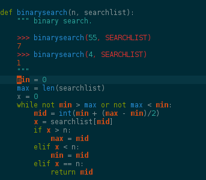

============
Programslice
============

.. image:: https://travis-ci.org/romanofski/programslice.svg?branch=master
   :target: https://travis-ci.org/romanofski/programslice
   :alt: Build status

Static analysis tool for python programs to see depending lines of code.

.. note:: The Python program ``programslice`` in itself is rather
   useless for the end user. Use it with the `Vim editor plugin
   <https://github.com/romanofski/programslice.vim>`__. See Installation
   for more information.

.. _programslice-installation:

Why Using Programslice
======================

The main benefits of the program are:

* the possibility to aid tracing the control flow of the program

* find variables that are unnecessary to the program state

Installation
============

Requirements: Python 2.7

* Install `programslice` first in your favourite virtualenv::

    $ pip install https://github.com/romanofski/programslice/archive/master.zip

* Install the Vim plugin by following the instructions on it's `github
  page <https://github.com/romanofski/programslice.vim>`_.

* Once the plugin is installed, either make sure that the
  ``programslice`` command is in your ``$PATH`` variable or you adjust
  the ``g:programslice_cmd`` variable in your ``~/.vimrc`` to point it
  to the executable.

Forms of Contribution
=====================

If you find this program useful, here is a list of how you can
contribute:

* buy me a book off my `wish list
  <http://www.amazon.com/gp/registry/wishlist/13873Q1WKYL2W/ref=cm_wl_rlist_go_o?>`_

* file issues against `programslice
  <https://github.com/romanofski/programslice/issues>`_ or the `vim
  plugin <https://github.com/romanofski/programslice.vim/issues>`_

* help to improve the code

Development
-----------

The project is hosted on github:

-  http://romanofski.github.io/programslice/
-  https://github.com/romanofski/programslice.vim

Backlogs:

-  https://github.com/romanofski/programslice/issues
-  https://github.com/romanofski/programslice.vim/issues

Documentation is available on:

-  http://programslice.readthedocs.org/

Screenshot

License
-------

GPLv3
